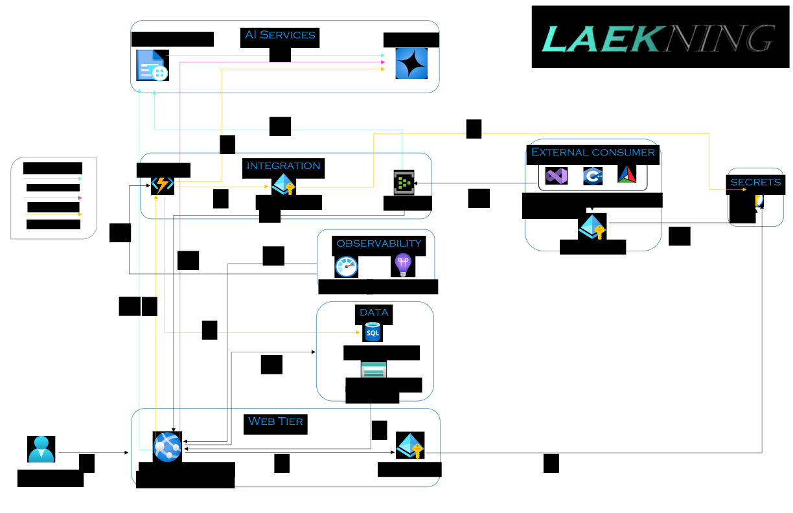

# LaekningPharmacy

## Overview

A cloud-native prototype online pharmacy web application built with **Azure Cloud, AI, and DevOps best practices**.  
This project demonstrates **secure infrastructure, event-driven architecture, and GenAI-powered features** for healthcare e-commerce.

* * *

## Features

*   **Authentication (Admin only)**: Secure login via Azure Entra ID (demo purpose).
*   **Product Management**: Admin can add, update, delete products.
*   **GenAI-Powered**:

    *   Prescription upload and identification of medicine (OCR with Azure Document Intelligence + Azure OpenAI).
    *   Health Assistant ChatBot (Using Azure OpenAI LLMs to query products in the actual database, i.e. Retrieval Augmented Generation).
    *   GenAI hybrid recommender (Using Azure OpenAI to query the actual database, based on user purchase).

*   **Serverless Microservices Architecture**: Azure functions to handle the product recommendation module
*   **Event-driven Processing**: Event Hub for async messaging (with a separate C++ consumer application).
*   **CI/CD Automation**: Azure DevOps pipelines for testing & deployment.

* * *

## Tech Stack

*   **Frontend**: Blazor / ASP.NET Core
*   **Backend**: C# / .NET APIs (.NET Version 8), Python API for Function App module (Python Version 3.11)
*   **AI/ML**: Azure AI Services (Document Intelligence and Azure OpenAI)
*   **Cloud**: Azure (Key Vault, Managed Identity, Event Hubs, Azure DevOps, Blob Storage, Azure SQL Database and Azure Functions and Application Insights)
*   **CI/CD**: GitHub → Azure DevOps pipelines
*   **External event consumer**: Visual C++, Azure SDK for C++ (packages handled with vcpkg) and CMake(For building the application itself)

* * *

## Project Structure

/LaekningPharmacy
         
  ├── docs/                        # Folder containing architecture diagram
 
 ├── Laekning/                           # Application code (ASP.NET)

 ├── Laekning.Tests/                     # Unit tests

 ├── LaekningEventHub/                   # C++ application to consume events

 ├── LaekningGenAIRecommendationModule/  # Functions app python code

 ├── azure-pipelines.yml                                       # Azure Pipelines YAML for CI/CD

 ├── LaekningSln.sln                           # Solution file

 ├── LICENSE                              # License file

 └── README.md                   # Project documentation

* * *

## Setup Instructions

1.  Clone repository
2.  Configure Azure resources (Key Vault, Event Hubs, Managed identities, Storage Accounts, Azure SQL Database, etc.)
3.  Add Key Vault Url in appsettings.json of the ASP.NET Core Application(not recommended) and main.cpp of the C++ event hub consumer application(not recommended) or pass it as an environment variable for both. 
4.  Add required API links and secrets to the Key Vault
5.  Either configure and adjust environment variables in Azure DevOps and run the pipeline or run the three modules manually

* * *

## Architecture

**WorkFlow**

1.      User begins to send requests to the ASP.NET application deployed at an app service instance.

2.      The application being run in the App Service instance gets assigned a managed identity before being authenticated to Key Vault.

3.      The application authenticates to the Key Vault to retrieve the following values:

         a.      The url to call the azure functions recommendation module (Saved as AzureFunctionsRecommendUrl in the key vault in this case).

         b.      The API Version to call Azure OpenAI Service (Saved as AzureOpenAIAPIVersion in the key vault in this case).

         c.      The key(s) to the deployed model in the Azure OpenAI service (Saved as AzureOpenAIDeploymentKeyOne and AzureOpenAIDeploymentKeyTwo in the key vault in this case).

         d.      The name of the deployed model in Azure OpenAI service (Saved as AzureOpenAIDeploymentName in the key vault in this case).

         e.      The endpoint to call the Azure OpenAI Service (Saved as AzureOpenAIDeploymentName in the key vault in this case).

         f.      The connection string to access the blob service in the Azure Storage Account. (Saved as BlobServiceConnectionString in the key vault in this case).

         g.      The Uri to access the Blob (Saved as BlobUri in the key vault in this case)

         h.      The name of the container in the Blob Storage (Saved as ContainerName in the key vault in this case).

         i.      The Key to the Document Intelligence Service (Saved as DocumentIntelligenceAPIKey in the key vault in this case).

         j.      The Endpoint to access the Document Intelligence Service (Saved as DocmentIntelligenceEndpoint in the key vault in this case).

         k.      The connection string to access event hubs to send and consume events (Saved as EventHubConnectionString in the key vault in this case).

         l.      The name of the event hubs instance (Saved as EventHubName in the key vault in this case).

         m.      The connection string of the Azure SQL database deployed to handle the administrator identity portion of the application (Saved as IdentityConnection in the key vault in this case).

         n.      The connection string of the Azure SQL database deployed to handle the products and orders of the application (Saved as LaekningConnection in the key vault in this case).

         o.      The ID of the model deployed to be used by the Document Intelligence service (Saved as OCRTrainingModelID in the key vault in this case).

         p.      The password used to login to the administrator portal (Stored as Password in the key vault in this case).

         q.      The connection string for python functions module (LaekningConnection but for python, saved as PythonSQLConnectionString in the key vault in this case).

         r.      The username used to login to the administrator portal (Stored as Username in the key vault in this case).

4.      The connection strings for Databases and the Storage Account is used to authenticate to the databases (to load seed data) and storage account (for blob service to be used).

5.      The application sends an API call to the function app programmed to recommend products.

6.      The function app itself gets assigned a managed identity to access the Key Vault.

7.      The managed identity then retrieves the credentials for Azure SQL database and Azure OpenAI Service on the behalf of the function app.

8.      The function app then uses the retrieved credentials from Step 7 to call the Azure OpenAI Service which then performs the required operations to return the product recommendations(checking for similar products which matches similar descriptions for previously purchased products).

9.      The function app then queries the actual product database to check if the product exists, which then gets displayed on the front page of the ASP.NET application.

10.     All the activity of function app is monitored and logged in the application insights instance.

11.     Using the retrieved credentials in step 3, the ASP.NET application then calls the Document Intelligence Service for the OCR functionality.

12.     After the Document Intelligence finishes with it’s OCR processes, it then calls the Azure OpenAI service to query the returned product names(in this case, drugs from the prescription) and displays the products in the application if available.

13.     Complementary to step 11, after the image is uploaded to blob storage for OCR analysis, the messages of the details identified about the image gets sent to event hubs to be consumed by an external service later on.

14.     Complementary to step 12, after the Azure OpenAI Service identifies the products in the database, the details of the products being identified and orders(just in case) gets sent to event hubs to be consumed by an external service later on.

15.     For the health assistant chatbot, after the request is sent by the user in form of natural language prompt, the prompt is then sent to Azure OpenAI Service for analysis, which then queries the actual database to retrieve the products according to the user requirements and if successful, sends the results to be displayed in the ASP.NET application.

16.     The uploaded images and product purchases (along with all the new products created) are added into the SQL database.

17.     The app service instance sends logs to Azure Monitor and Application Insights instance.

18.     The external C++ application that is to consume events uses it’s own managed identity to retrieve event hub credentials to consume events from Event Hubs.

19.     The C++ application then consumes the events sent by the Event Hubs instance.

* * *

## Demo Video

[Link to the demo video](https://youtu.be/amo5rdLA27Q)

* * *

## Future Scope

*   **Customer Authentication & Role-based Access**
*   **Payment Integration (Stripe/PayPal sandbox)**
*   **Traditional ML Recommendation Engine** as data grows
*   **Hybrid AI pipeline**: GenAI + classical ML personalization
*   **Scaling via Kubernetes (AKS)**

* * *

## License

MIT License
